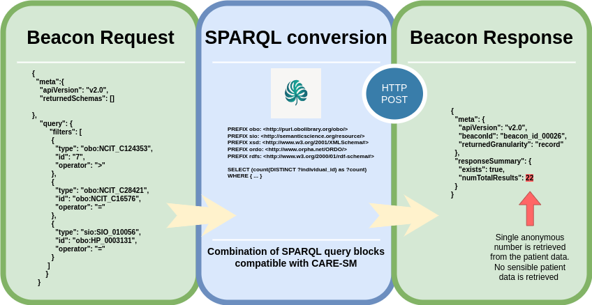

# Beacon-API4CARE-SM

Beacon API for patient data discoverability represented using [CARE Semantic Model](https://github.com/CARE-SM/CARE-Semantic-Model). 

<p align="center"> 
	
</p>
<p align="center"><b>beacon API architecture</b></p>


This Beacon API converts Beacon Requests for individuals into CARE-SM SPARQL counting queries. After executing the query, it retrieves a Beacon Response. This implementation does not expose any sensitive patient data; only the count is included in the response.

**Considerations:**

Beacon-API4CARE-SM is only compatible with Triplestore repositories that contain CARE-Semantic Model patient data. 

Beacon-API4CARE-SM implements `/individuals` endpoint for querying patient counts. However `/catalogs` or `/biosamples` endpoints are not included for this implementation.

Beacon-API4CARE-SM is compatible with **Beacon v4.0 API**

## Documentation:

* [EJP-RD Virtual Platform specifications for Beacon API v4.0](https://github.com/ejp-rd-vp/vp-api-specs)

* [CARE Semantic Model](https://github.com/CARE-SM/CARE-Semantic-Model)


## API essential paths:

#### 1. ``/openapi.json``: OpenAPI specification (HTTP GET)

#### 2. ``/filtering_terms``: Available filters for your counting query (HTTP GET)

**Examplar Beacon response for available filters:**

```json

{
  "meta": {
    "apiVersion": "v4.0",
    "beaconId": "undefined beacon ID",
    "returnedSchemas": []
  },
  "response": {
    "resources": [
      {
        "id": "ncit",
        "name": "NCIT",
        "url": "http://purl.obolibrary.org/obo/ncit.owl",
        "version": "2023-101-19",
        "namespacePrefix": "obo",
        "iriPrefix": "http://purl.obolibrary.org/obo/"
      },
      {
        "id": "ordo",
        "name": "Orphanet Ontology",
        "url": "https://www.orphadata.com/data/ontologies/ordo/last_version/ORDO_en_4.4.owl",
        "version": "4.4",
        "namespacePrefix": "ordo",
        "iriPrefix": "http://www.orpha.net/ORDO/"
      },
      {
        "id": "hp",
        "name": "Human Phenotype Ontology",
        "url": "http://purl.obolibrary.org/obo/hp.owl",
        "version": "2024-07-01",
        "namespacePrefix": "hp",
        "iriPrefix": "http://purl.obolibrary.org/obo/HP_"
      },
      {
        "id": "sio",
        "name": "Semanticscience Integrated Ontology",
        "url": "http://semanticscience.org/ontology/sio/v1.59/sio-release.owl",
        "version": "1.59",
        "namespacePrefix": "sio",
        "iriPrefix": "http://semanticscience.org/resource/"
      },
      {
        "id": "edam",
        "name": "EDAM",
        "url": "https://edamontology.org/EDAM_1.25.owl",
        "version": "1.21",
        "namespacePrefix": "edam",
        "iriPrefix": "http://edamontology.org/"
      }
    ],
    "filteringTerms": [
      {
        "id": "ncit:C28421",
        "label": "Sex",
        "type": "ontology",
        "scopes": [
          "individuals"
        ]
      },
      {
        "id": "ncit:C2991",
        "label": "Disease or Disorder",
        "type": "ontology",
        "scopes": [
          "individuals"
        ]
      },
      {
        "id": "sio:SIO_010056",
        "label": "Phenotype",
        "type": "ontology",
        "scopes": [
          "individuals"
        ]
      },
      {
        "id": "edam:data_2295",
        "label": "Causative Genes",
        "type": "alphanumerical",
        "scopes": [
          "individuals"
        ]
      },
      {
        "id": "ncit:C83164",
        "label": "Age this year",
        "type": "numeric",
        "scopes": [
          "individuals"
        ]
      },
      {
        "id": "ncit:C124353",
        "label": "Age at symptom onset",
        "type": "numeric",
        "scopes": [
          "individuals"
        ]
      },
      {
        "id": "ncit:C156420",
        "label": "Age at diagnosis",
        "type": "numeric",
        "scopes": [
          "individuals"
        ]
      }
    ]
  }
}

```


#### 3.``/individuals``: Define metadata and filters for your counting query (HTTP POST)

Exemplar Beacon v4.0 Request containing containg several of these filters:

```json
{ 
  "meta":{
    "apiVersion": "v4.0",
    "returnedSchemas": []

},
    "query": {
         "filters": [
          {
            "type": "obo:NCIT_C124353",
            "id": "7",
            "operator": ">"
          },
          {
            "type": "obo:NCIT_C28421",
            "id": "obo:NCIT_C16576",
            "operator": "="
          },
          {
            "type": "sio:SIO_010056",
            "id": "obo:HP_0003131",
            "operator": "="
          }
        ]
       }
   }
```
For more examples, please check your [exemplar_body](/exemplar_body/) folder.

**Example of Beacon v4.0 Response:**

```json
{
  "meta": {
    "apiVersion": "v4.0",
    "beaconId": "undefined beacon ID",
    "returnedGranularity": "record"
  },
  "response": {
    "resultSets": [
      {
        "id": "result_20240729100721832574",
        "type": "dataset",
        "exists": true,
        "resultCount": 22
      }
    ]
  },
  "responseSummary": {
    "exists": true,
    "numTotalResults": 22
  }
}

```

## Installation

This whole implementation is Dockerized at Docker hub, check our public Docker image [here](https://hub.docker.com/repository/docker/pabloalarconm/beacon-api4care-sm/).

This beacon API consumes environmental variables for all required parameters related to:
 * Triplestore information (endpoint/username/password) 
 * Available Beacon filters to query
 * URL of the server

You can run the docker image in a `docker-compose` file that contains your environmental variables:


``` yaml
version: '3'
services:
  api:
    image: pabloalarconm/beacon-api4care-sm:0.2.3
    ports:
      - "8000:8000"
    environment:
      - TRIPLESTORE_URL=http://localhost:7200/repositories/exemplar_vp_repo #exemplar endpoint
      - TRIPLESTORE_USERNAME=admin
      - TRIPLESTORE_PASSWORD=root
      - URL_SERVER=http://0.0.0.0:8000/

      - FILTER_SEX=True
      - FILTER_DISEASE=True
      - FILTER_SYMPTOM=True
      - FILTER_GENE_VARIANT=True
      - FILTER_BIRTHYEAR=True
      - FILTER_AGE_SYMPTOM_ONSET=True
      - FILTER_AGE_DIAGNOSIS=True

```

This beacon-API4CARE-SM is already deployed at [FAIR-in-a-box](https://github.com/ejp-rd-vp/FiaB) (Fiab) interface, combined with all CARE-SM related requirements to make perform data discoverability for your patient registries.